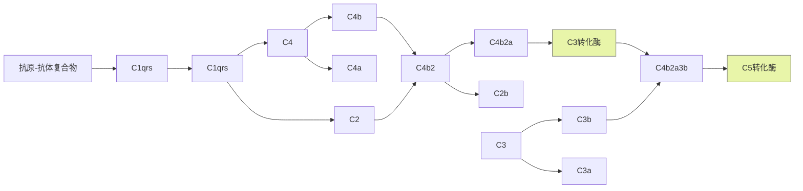

# 参与成分
C1q,C1r,C1s,C4,C2和C3
# 激活顺序

# C3/C5转化酶
C3转化酶 C4b2a
C5转化酶 C4b2a3b
# 激活物
与抗原结合的IgG和IgM,IgM>IgG3>IgG1>IgG2
与微生物表面结合的CRP、SAP和PTX3
# 特点
经典结合途径的启动有赖于特异性抗体产生，在<u>感染后期</u>（或恢复期）发挥作用，并参与机体抵御相同病原体的再次感染