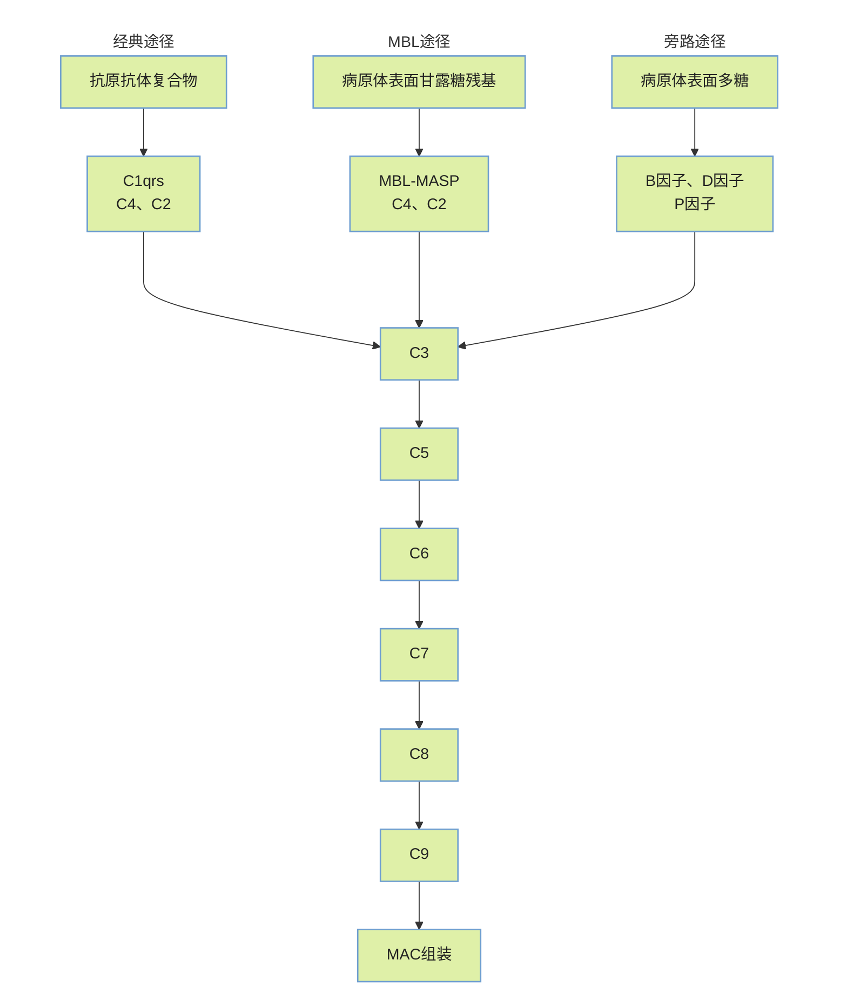

# 定义
补体系统(copmlement system)，也称为补体级联反应，是体液固有免疫系统的一部分，但也可以被适应性免疫系统产生的抗体募集并激活。

补体系统由多种在血液中循环的、由肝脏合成的小型、无活性的蛋白质前体组成。
补体是人或脊椎动物体内的一种具有酶活性的不耐热的蛋白质
# 组成成分
## 补体固有成分
1. 经典激活途径特有的： C1q,C1r,C1s,C2,C4
2. 旁路激活途径特有的：B因子，D因子和备解素（P因子）
3. 凝集素途径特有的：甘露糖结合凝集素（MBL），MBL相关丝氨酸蛋白（MASP）
4. 补体活化的共同部分：C3,C5,C6,C7,C8,C9
## 补体调节蛋白
存在于血浆和细胞膜表面，通过调节补体激活途径中关键酶而控制补体活化强度和范围的蛋白因子。如H因子，I因子，C1INH，DAF等
## 补体受体
指存在于不同细胞膜表面、能与补体激活后所形成的活性片段相结合、介导多种生物效应的受体分子。其中 <u>CR1通过结合C3b/C4b参与免疫复合物清除及补体调节，CR2作为B细胞表面C3d受体可介导信号传导，CR3/CR4则以iC3b为配体介导吞噬作用</u>
# 来源与激活
## 补体的来源
1. 不同组织细胞均能合成补体蛋白，==肝细胞和巨噬细胞==是补体的主要产生细胞
2. 血浆中大部分补体组分由肝细胞分泌，但在不同组织中，尤其在炎症病灶，巨噬细胞是补体的主要来源
3. 补体的多数成分属$\beta$球蛋白，其中==C3含量最高==；对热最敏感，56℃ 30min灭活；血浆补体每天约有一半更新
## 补体的激活途径
它的激活途径分为三种：[[经典激活途径|经典激活途径 classical pathway]]、[[替代补体途径|旁路途径 alternative pathway]]、[[凝集素聚集途径|凝集素途径 lectin pathway]]。
在三种生物进化的途径中，替代补体激活途径最早出现，然后是凝集素聚集途径，最后是经典激活途径。

经典激活途径 —— 抗原-抗体复合物
替代补体激活途径 —— 补体成分（C3）自发水解、外来物质、病原体或受损细胞
甘露糖结合的凝集素聚集途径 —— 可在没有抗体的途径下通过C3水解或抗原激活

三种激活途径之后的共同途径

# 功能
- 膜攻击 —— 通过破坏细菌细胞壁 （[[经典激活途径]]）
- 吞噬作用 —— 通过调理抗原。C3b具有最重要的调理活性（[[替代补体途径]]）
- 炎症反应 —— 通过吸引巨噬细胞和中性粒细胞 （[[凝集素聚集途径]]）